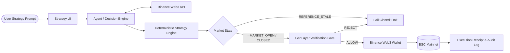

# StockPilot ✈️📈

> **Autonomous BSC Rebalancing Agent for Tokenized Stocks**  
> Built for the **BNB Hack: Tokenized Stocks Edition** (Sep 16 – Oct 11, 2026)  
> Target Network: **BNB Smart Chain (BSC) Mainnet**

---

## 📌 Executive Summary

**StockPilot** is an autonomous portfolio rebalancing agent on BSC designed for tokenized US equities (e.g. bNVDA, Ondo, xStocks) and stablecoins (USDC). Users specify their allocation in plain English (e.g., *"Keep 60% tokenized NVIDIA and 40% USDC. Rebalance when the stock allocation drifts more than 5%"*). 

StockPilot monitors the BSC portfolio, calculates drift using deterministic risk math, evaluates reference market conditions, submits verifiable evidence through an independent verification gate, and executes spot-only rebalancing swaps via the **Binance Web3 API** and **Binance Web3 Wallet / Agentic Wallet**.

---

## 🏛️ Architecture & Flow



### Component Decoupling
- **UI (`src/client`)**: Strategy definition, real-time drift display, tri-state market badge, and audit history.
- **Agent Orchestrator (`src/agent`)**: Pipeline coordination and cycle monitoring.
- **Binance Web3 API Client (`src/binance`)**: Token balances, DEX aggregator spot quotes, and reference data.
- **Strategy & Risk Engine (`src/strategy`)**: Pure deterministic allocation math, drift calculations, and trade bounds.
- **Verification Adapter (`src/verification`)**: Independent GenLayer verification gate evaluating evidence packets (does *not* execute trades).
- **Execution Adapter (`src/execution`)**: Binance Web3 Wallet / Agentic Wallet spot execution on BSC mainnet.
- **Persistence (`src/storage`)**: Immutable append-only audit trail.

---

## 🚦 Important Market-State Feature

StockPilot explicitly distinguishes between three market states:
1. 🟢 **`MARKET_OPEN`**: Traditional US equities market (NYSE/NASDAQ) is active (09:30–16:00 ET, Mon–Fri). Normal slippage and drift rules apply.
2. 🟡 **`MARKET_CLOSED`**: US market is closed; tokenized stock continues trading on BSC. Stricter slippage limits and safety bounds apply to protect against low after-hours liquidity.
3. 🔴 **`REFERENCE_STALE`**: Oracle quote or reference feed is older than `MAX_STALENESS_SECONDS` (default: 900s). **System fails closed immediately** — all trading proposals are blocked.

---

## 🛡️ Hackathon Quality & Fail-Closed Rules

- **Spot transactions only**: No perps, no margin, no synthetic leverage.
- **No fake data**: Zero mock/fabricated transactions or market prices presented as live BSC mainnet data.
- **Independent verification**: Rebalancing proposals pass through a verification gate with complete evidence packets.
- **Fail closed**: Missing balances, stale feeds, or failed verifications unconditionally abort execution.
- **DevEx tracking**: Real Binance Web3 API requests, latencies, responses, and friction points logged in [`docs/hackathon-build/devex-log.md`](docs/hackathon-build/devex-log.md).

---

## 🚀 Quickstart & Running Locally

### 1. Prerequisites
- **Node.js** v20+ or v24+
- **npm** v10+

### 2. Installation
```bash
npm install
```

### 3. Environment Configuration
Copy the environment template and configure server-side settings:
```bash
cp .env.example .env
```
*(Never commit `.env` or hard-code API keys, secrets, or private keys).*

### 4. Run Deterministic Strategy & Risk Tests
```bash
npm test
```

### 5. Start Development Server
```bash
npm run dev
```
The server will start at `http://localhost:3000`. You can inspect system health and market status at:
```bash
curl http://localhost:3000/api/health
```

---

## 📂 Project Directory Structure

```text
StockPilot/
├── docs/
│   └── hackathon-build/
│       ├── scope.md                     # MVP boundary & non-goals
│       ├── architecture.md              # Detailed architecture & sequence diagrams
│       ├── build-notes.md               # Technical decisions & deterministic math
│       ├── mvp-acceptance-checklist.md  # Acceptance criteria & sign-off tracker
│       └── devex-log.md                 # Real Binance Web3 API integration log (25% score)
├── src/
│   ├── agent/                           # Agent orchestrator & cycle coordination
│   ├── binance/                         # Binance Web3 API client interface & implementations
│   ├── execution/                       # Binance Web3 Wallet spot execution adapter
│   ├── server/                          # Express HTTP server & health endpoints
│   ├── storage/                         # Append-only persistence & audit store
│   ├── strategy/                        # Deterministic risk engine & drift calculator
│   ├── types/                           # Core TypeScript interfaces & domain models
│   └── verification/                    # GenLayer independent verification adapter
├── tests/
│   └── strategy.test.ts                 # Unit tests for deterministic math & fail-closed logic
├── .env.example                         # Environment variable documentation
├── package.json                         # Project dependencies and test scripts
├── tsconfig.json                        # TypeScript configuration
└── README.md                            # Main project documentation
```

---

## 📚 Documentation Links
- [Scope & Requirements](docs/hackathon-build/scope.md)
- [Architecture & Diagrams](docs/hackathon-build/architecture.md)
- [Build Notes](docs/hackathon-build/build-notes.md)
- [MVP Acceptance Checklist](docs/hackathon-build/mvp-acceptance-checklist.md)
- [Developer Experience (DevEx) Log](docs/hackathon-build/devex-log.md)
