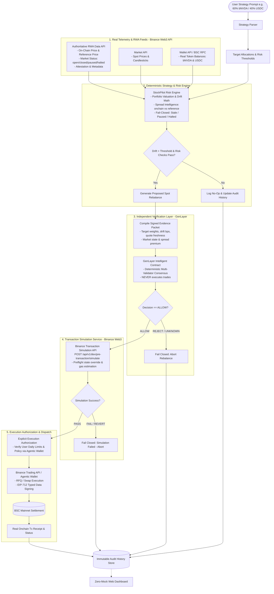

# StockPilot Architecture Specification

> **BNB Hack: Tokenized Stocks Edition** (Sep 16 – Oct 11, 2026)  
> **System**: StockPilot Autonomous BSC Portfolio Rebalancer  
> **Core Asset**: `NVDA` Tokenized Equity — Backed NVIDIA (`NVDAB` — `0x02fca66c1d1afb4e2a7884261eb00f63598a7436`) & `USDC` (`0x8AC76a51cc950d9822D68b83fE1Ad97B32Cd580d`). *Note: Initial spec address `0xA34C5e0AbE843E10461E2C9586Ea03E55Dbcc495` is [STALE / INVALIDATED BY LIVE BINANCE REGISTRY].*  
> **Data Integrity**: Strict Zero-Mock Policy  

---

## 1. System Overview

StockPilot is an autonomous BSC agent that lets users define tokenized-stock allocation strategies in plain English, continuously monitors their on-chain portfolio, verifies proposed rebalances against deterministic risk parameters and an independent verification gate, validates transaction viability via preflight simulation, and safely executes spot rebalancing via the Binance Web3 API and Binance Agentic Wallet.

---

## 2. Updated End-to-End Decision Pipeline

The StockPilot architecture enforces strict separation of responsibilities across each layer of the pipeline:

$$\begin{aligned}
\text{USER STRATEGY} &\longrightarrow \text{STRATEGY PARSER} \\
&\longrightarrow \text{REAL RWA DATA} \\
&\longrightarrow \text{REAL MARKET DATA} \\
&\longrightarrow \text{REAL WALLET STATE} \\
&\longrightarrow \text{DETERMINISTIC STRATEGY / RISK ENGINE} \\
&\longrightarrow \text{PROPOSED ACTION} \\
&\longrightarrow \text{GENLAYER INDEPENDENT VERIFICATION} \\
&\longrightarrow \text{BINANCE TRANSACTION SIMULATION} \\
&\longrightarrow \text{EXPLICIT EXECUTION AUTHORIZATION} \\
&\longrightarrow \text{BINANCE TRADING / AGENTIC WALLET} \\
&\longrightarrow \text{BSC MAINNET} \\
&\longrightarrow \text{REAL RECEIPT / STATUS} \\
&\longrightarrow \text{AUDIT HISTORY}
\end{aligned}$$



---

## 3. Core Architectural Modules & Responsibilities

### 3.1 RWA Data API (Authoritative Tokenized-Equity Source)
The RWA Data API is the primary authority for tokenized equities (`bNVDA`, Ondo assets):
- **Token Discovery & Metadata**: Contract address, issuer backing (Backed Finance), decimals (`18`), and backing ratio (`sharesMultiplier`).
- **Dual-Price Discovery**:
  - `onchainPrice`: Real-time spot price of tokenized equity on BSC.
  - `referencePrice`: Real-time underlying traditional equity reference price.
- **Authoritative Market Status**: Must never be inferred from static calendars. The system explicitly distinguishes and handles:
  - 🟢 `MARKET_OPEN` / `premarket` / `regular` / `postmarket` / `overnight`
  - 🟡 `MARKET_CLOSED`
  - 🟠 `PAUSED`
  - 🔴 `HALTED`
  - ⚪ `UNAVAILABLE`
  - ❓ `UNKNOWN`
- **Next Open/Close Time**: Authoritative timestamps provided by Binance Web3 / DeFI endpoints (`/market/status/ai` and `/asset/market/status/ai`).

### 3.2 Market API (Crypto & Supporting Feeds)
- Real-time spot pricing for counter-assets (`USDC`) and native gas (`BNB`).
- Candlesticks and volume metrics for secondary liquidity analysis.
- Fails closed if data timestamps exceed `MAX_STALENESS_SECONDS` (default: 60s).

### 3.3 Wallet API & BSC RPC Fallback (Real Portfolio State)
- Queries token balances via `POST /api/v1/dex/balance/token-balances-by-address`.
- Incorporates direct BSC JSON-RPC (`eth_call` for ERC-20 `balanceOf`) as an authoritative, zero-mock fallback to guarantee uncompromised state verification.

### 3.4 On-Chain vs. Reference Price Intelligence (StockPilot Differentiator)
When the RWA Data API provides both `onchainPrice` and `referencePrice`, StockPilot calculates the real-time spread deterministically:

$$\text{spread} = \frac{\text{onchainPrice} - \text{referencePrice}}{\text{referencePrice}}$$

- **Zero-Mock Rendering**: Calculated and displayed **only** when both feeds are valid and live. If either is missing, stale, or unavailable, the UI and API explicitly return `—`.
- **Strategy Condition Integration**: The deterministic risk engine evaluates user-defined spread constraints (e.g., *"Do not buy if tokenized price is > 2.0% above traditional reference"*), preventing toxic arbitrage or paying excessive illiquidity premiums.

### 3.5 Real Deterministic Strategy & Risk Engine (`src/strategy/portfolio-engine.ts` & `risk-engine.ts`)
- Pure mathematical calculation of portfolio weights, drift basis points, and rebalance amounts based strictly on verified live data.
- **Zero Mock Policy**:
  - Never fabricates missing balance or price data.
  - Returns `INSUFFICIENT_PORTFOLIO_DATA` when balances are genuinely zero or total portfolio valuation is zero (never invents a fake 60/40 allocation).
  - Evaluates live on-chain vs. reference price spread and enforces risk boundaries.
- **Six Explicit Decision States**:
  1. `NO_ACTION`: Portfolio allocation drift is strictly within the tolerance threshold (default: 500 bps / 5.0%).
  2. `REBALANCE_REQUIRED`: Allocation drift exceeds threshold and all verified risk checks pass. Proposes deterministic `BUY_STOCK` or `SELL_STOCK`.
  3. `INSUFFICIENT_PORTFOLIO_DATA`: Both asset balances are zero or total portfolio valuation is $\le 0$. No fake portfolio weights generated.
  4. `MARKET_CLOSED`: Underlying equity session is closed and strategy policy disallows closed-market rebalancing.
  5. `DATA_UNAVAILABLE`: Missing, invalid, or stale price quotes or balance telemetry; or reference data stale (`REFERENCE_STALE`).
  6. `RISK_BLOCKED`: Proposed rebalance blocked by risk boundaries (e.g., token/reference price spread exceeds `maxSpreadBps`).
- **Configurable Safety Boundaries**:
  - Max trade size per rebalance (`maxSingleTradeUsd`, e.g. $5,000 USD circuit breaker).
  - Max slippage tolerance: 50 bps in open session, 25 bps in closed/overnight session.
  - Max spread premium threshold (`maxSpreadBps`, default: 200 bps / 2.0%).
  - Minimum drift activation threshold (`driftThresholdBps`, default: 500 bps / 5.0%).
- **Standard MVP Configuration (`DEFAULT_MVP_STRATEGY_CONFIG`)**:
  - Target: 60% NVDAB (`0x02fca66c1d1afb4e2a7884261eb00f63598a7436`) / 40% USDC (`0x8AC76a51cc950d9822D68b83fE1Ad97B32Cd580d`).
  - Drift threshold: 500 bps (5.0%). Circuit breaker: $5,000 USD. Max spread: 200 bps (2.0%). Fail-closed when market closed.

### 3.6 Independent Verification Layer (GenLayer — `contracts/rebalance_verifier.py` & `src/verification/genlayer-adapter.ts`)
- Evaluates proposed rebalances as an external, independent validator consensus gate.
- **Strict Boundary**: GenLayer **never executes trades, holds private keys, signs transactions, or submits orders**.
- **Canonical Evidence Payload (`CanonicalEvidencePayload`)**:
  - Deterministic serialization with alphabetically sorted keys and SHA-256 evidence hashing.
  - Contains strategy configuration, verified wallet balance evidence, live NVDAB token and reference prices, deterministic spread, market session status, snapshot weights, proposal delta, and risk checks.
- **Independent Verification Invariants**:
  1. Proposal mathematically matches supplied portfolio balance valuations.
  2. Drift calculation is independently reconciled ($|\text{Weight} - \text{Target}|$).
  3. Proposed trade direction is consistent with drift (`BUY_STOCK` when underweight, `SELL_STOCK` when overweight, `NONE` when within threshold).
  4. Trade amount does not exceed circuit breaker (`maxSingleTradeUsd`).
  5. Market session permits proposed action (blocks trades when `MARKET_CLOSED` or `REFERENCE_STALE`).
  6. Real token/reference spread does not violate configured risk boundary (`maxSpreadBps` on `BUY_STOCK`).
  7. Zero/empty portfolio balances (`0 tokens`) are **never converted into synthetic weights** (strictly rejected).
  8. Stale quotes ($> 900\text{s}$) or tampered evidence hashes are unconditionally rejected.
- **Fail-Closed Consensus Protocol**:
  - Unavailable GenLayer result $\rightarrow$ `NOT_VERIFIED` (`REJECT`).
  - RPC timeout / network error $\rightarrow$ `NOT_VERIFIED` (`REJECT`).
  - Malformed schema $\rightarrow$ `NOT_VERIFIED` (`REJECT`).
  - Validator disagreement / `NO_MAJORITY` $\rightarrow$ `NOT_VERIFIED` (`REJECT`).
  - Unconfigured contract address $\rightarrow$ `NOT_VERIFIED` (`REJECT`).
  - Only an explicitly valid proposal with unanimous consensus receives `VERIFIED` (`ALLOW`).
- **Defensive Structured Schema & Custom Comparator**:
  - Does **not** use `strict_eq` on non-deterministic LLM text outputs. Uses structured JSON schema with field-level agreement on `status` (`ALLOW`/`REJECT`), `evidence_hash`, and rule flags.
- **Immutable Audit Trail**:
  - Persists `auditId`, `proposalId`, `strategyId`, `evidenceHash`, `canonicalPayload`, `status`, `decision`, `reason`, `verifiedAt` without exposing credentials or keys.

### 3.7 Transaction Simulation Service (Binance Web3 — `src/binance/simulation-client.ts`)
- **Strict Sequential Order**: `REAL TELEMETRY → DETERMINISTIC STRATEGY → GENLAYER VERIFICATION → BINANCE TRANSACTION SIMULATION → AGENTIC WALLET EXECUTION`.
- **Preflight Only**: Evaluates transaction viability via Binance Web3 Transaction API (`POST /build/api/v1/dex/pre-transaction/simulate`) before any signing request or execution dispatch is attempted.
- **Read-Only Guarantee**: Never broadcasts transactions, holds private keys, submits orders, or moves funds.
- **Fail-Closed Guardrails**:
  1. Unverified proposal (`decision !== 'VERIFIED'` or `status !== 'ALLOW'`) $\rightarrow$ immediately rejected.
  2. Proposal action `NONE` $\rightarrow$ simulation skipped (`NO_ACTION_PROPOSAL`).
  3. Evidence hash mismatch (tampered payload) $\rightarrow$ rejected (`HASH_MISMATCH`).
  4. Proposal ID mismatch $\rightarrow$ rejected (`ID_MISMATCH`).
  5. Market closed (`canonicalPayload.marketState !== 'MARKET_OPEN'`) $\rightarrow$ rejected (`MARKET_CLOSED`).
  6. Stale quote telemetry ($> 60\text{s}$) $\rightarrow$ rejected (`STALE_QUOTE`).
  7. Spread risk breach ($> \text{maxSpreadBps}$) $\rightarrow$ rejected (`SPREAD_RISK_BREACH`).
  8. Invalid / zero-address wallet $\rightarrow$ rejected (`INVALID_WALLET`).
  9. Non-positive trade amounts $\rightarrow$ rejected (`INVALID_TRADE_AMOUNT`).
  10. Binance API error response $\rightarrow$ rejected (`SIMULATION_ERROR`).
  11. Binance KYT risk block code (`40311`, `40312`, `40313`, `40314`, `40434`) $\rightarrow$ rejected (`RISK_BLOCKED`).
  12. On-chain revert with explicit reason $\rightarrow$ rejected (`REVERT`).
  13. Missing or invalid gas/fee data $\rightarrow$ rejected (`MISSING_FEE_DATA`).
- **Cryptographic Audit Trail**:
  - Every simulation evaluation creates an immutable in-memory audit record with a deterministic SHA-256 simulation hash. Accessible via `getAuditTrail()`.

### 3.8 Live Execution Boundary & Agentic Wallet Integration (`src/execution/`)
StockPilot enforces the final execution boundary using the official Binance Agentic Wallet (`baw`):

$$\begin{aligned}
\text{REAL TELEMETRY} &\longrightarrow \text{DETERMINISTIC STRATEGY} \\
&\longrightarrow \text{GENLAYER VERIFIED} \\
&\longrightarrow \text{BINANCE SIMULATION PASSED} \\
&\longrightarrow \text{AGENTIC WALLET POLICY CHECK} \\
&\longrightarrow \text{EXPLICIT USER APPROVAL} \\
&\longrightarrow \text{TINY LIVE SPOT EXECUTION} \\
&\longrightarrow \text{ORDER / TRANSACTION STATUS} \\
&\longrightarrow \text{BSC RECEIPT CONFIRMATION} \\
&\longrightarrow \text{AUDIT LOG}
\end{aligned}$$

#### 3.8.1 Pre-Execution Hard Gates (14+ Verification Requirements)
The execution adapter accepts ONLY proposals meeting all of the following sequential requirements:
1. `strategy decision == REBALANCE_REQUIRED` (non-zero drift exceeding threshold).
2. `GenLayer decision == VERIFIED` and `status == ALLOW`.
3. Canonical evidence SHA-256 hash matches recomputed evidence hash.
4. Proposal ID matches across canonical payload and verification result.
5. Binance simulation decision == `SIMULATED_OK` and status == `SUCCESS`.
6. Simulation hash matches current proposal ID and evidence hash.
7. Market is open (`canonicalPayload.marketState === 'MARKET_OPEN'`).
8. Quote is fresh (`canonicalPayload.quoteAgeSeconds <= maxAllowedQuoteAgeSeconds`, default 900s).
9. Spread is within configured limit (`spreadBps <= maxSpreadBps`, default 200 bps).
10. Trade amount is positive and within the $5,000 circuit breaker.
11. Trade amount is within the configured tiny live execution cap (`tinyExecutionCapUsd`, default $25.00).
12. Wallet address is valid and non-zero EVM address.
13. Required asset addresses are dynamically resolved and valid EVM contracts.
14. No stale telemetry or unresolved verification state.

#### 3.8.2 Agentic Wallet Policy & Zero-Balance Controls
- **Zero Balance Guard**: If the user's wallet has 0 NVDAB and 0 USDC, execution is immediately aborted with `EXECUTION_BLOCKED_INSUFFICIENT_LIVE_BALANCE`. Zero mock invariant: never fabricates funds.
- **Direction Balance Check**: For `BUY_STOCK`, wallet must have sufficient USDC; for `SELL_STOCK`, wallet must have sufficient NVDAB.
- **Status & Tx-Lock**: Requires `wallet status == CONNECTED` and `wallet tx-lock == UNLOCKED`. Fails closed if locked due to pending on-chain transactions or app double-confirmation.
- **Spending Limit Quota**: Checks `wallet settings`: `quotaLeft >= proposedTradeAmountUsd`. Fails closed if daily limit is exceeded.
- **Token Allowlist**: Checks `tradeAllTokens` and explicit token allowlists.

#### 3.8.3 Explicit User Approval Boundary
- The first live execution milestone strictly enforces user-controlled authorization (`requireUserApproval = true`).
- No autonomous trade can execute merely because an AI or GenLayer verification result indicates `ALLOW`.
- An interactive `UserApprovalRequest` is presented with complete execution parameters (assets, amounts, price, slippage, estimated fee, idempotency key).
- Missing approval returns `APPROVAL_REQUIRED`. Denied approval transitions to `EXECUTION_BLOCKED` (`EXECUTION_BLOCKED_USER_APPROVAL_DENIED`).

#### 3.8.4 Duplicate Execution Protection (Idempotency)
- Derives a deterministic cryptographic SHA-256 idempotency key:
  $$\text{idempotencyKey} = \text{SHA-256}(\text{proposalId} \parallel \text{evidenceHash} \parallel \text{simulationHash} \parallel \text{walletAddress})$$
- Retried proposals with identical keys are rejected with `EXECUTION_BLOCKED_DUPLICATE_EXECUTION`, preventing duplicate trades.

#### 3.8.5 Terminal Status & BSC On-Chain Receipt Confirmation
- Dispatches spot-only swap via `baw market-order swap --fromTokenQty ... --fromToken ... --toToken ... --binanceChainId 56 --json`.
- State transitions to `EXECUTION_PENDING` with returned `orderId`.
- Polls `baw market-order list --orderId <id> --json` to terminal status (`FINISHED` or `FAILED`).
- On `FINISHED`, queries BSC Mainnet JSON-RPC (`eth_getTransactionReceipt(txHash)`).
- Validates on-chain status:
  - `0x1` $\rightarrow$ `EXECUTION_CONFIRMED`.
  - `0x0` (reverted on-chain) $\rightarrow$ `EXECUTION_FAILED`.
  - Ambiguous / lost network responses $\rightarrow$ `EXECUTION_UNKNOWN` (never converts uncertainty into success).

#### 3.8.6 Immutable Audit Logging
Every execution cycle creates an immutable audit record containing:
`auditId`, `proposalId`, `strategyId`, `verificationHash`, `simulationHash`, `walletAddress`, `tokenContract`, `direction`, `requestedAmount`, `actualExecutedAmount`, `executionOrderId`, `txHash`, `submissionTimestamp`, `confirmationTimestamp`, `finalExecutionStatus`, `failureReason`, `idempotencyKey`, `isDryRun`.
Zero private keys, secrets, or mnemonic material are ever stored or logged.

### 3.9 BNB Agent Studio Integration
- StockPilot operates as an autonomous agent registered with **BNB Agent Studio**.
- Ingests scheduled cron triggers and portfolio alert events, driving the rebalancing loop autonomously rather than functioning solely as a passive web dashboard.

---

## 4. Exact User Setup Required for Binance Agentic Wallet

To execute user-approved spot rebalances via StockPilot, the user's environment must be configured as follows:

### 4.1 CLI Installation & Authentication
1. Install the official Binance Agentic Wallet CLI:
   ```bash
   npm install -g @binance/agentic-wallet
   ```
2. Authenticate the wallet session:
   ```bash
   baw auth signin
   baw auth verify --code <YOUR_CODE>
   ```
3. Verify wallet connection status:
   ```bash
   baw wallet status --json
   # Must return: { "success": true, "data": { "status": "CONNECTED" } }
   ```
4. Verify wallet addresses on BSC Mainnet (Chain ID `56`):
   ```bash
   baw wallet address --json
   ```

### 4.2 Spending Allowance & Daily Quota
1. View current security limits:
   ```bash
   baw wallet settings --json
   ```
2. Configure daily spending limits in the **Binance App**:
   - Open Binance App $\rightarrow$ Web3 $\rightarrow$ Agentic Wallet $\rightarrow$ Settings.
   - Set **Daily Transaction Limit** (e.g., $100 – $5,000 USD).
   - Ensure remaining quota (`quotaLeft`) exceeds the proposed rebalance trade amount.

### 4.3 Token Allowlist
1. In the Binance App Agentic Wallet settings:
   - Either enable **Trade All Tokens** (`tradeAllTokens: true`), or
   - Add the target token contracts to the allowed tokens list:
     * **bStocks NVIDIA (`NVDAB`)**: `0x02fca66c1d1afb4e2a7884261eb00f63598a7436`
     * **Binance-Peg USDC (`USDC`)**: `0x8AC76a51cc950d9822D68b83fE1Ad97B32Cd580d`

### 4.4 Token Approvals & Transaction Lock
1. Verify active token approvals:
   ```bash
   baw approvals list --binanceChainId 56 --json
   ```
2. Verify wallet transaction lock state:
   ```bash
   baw wallet tx-lock --binanceChainId 56 --json
   # Must return: { "success": true, "data": { "status": "UNLOCKED" } }
   ```
   If `LOCKED`, complete any pending approvals or double-confirmations in the Binance App.

### 4.5 User Approval Step
- When StockPilot identifies a rebalancing opportunity that passes GenLayer verification and Binance simulation, it presents the `UserApprovalRequest`.
- The user reviews the trade parameters and explicitly submits confirmation (`approved: true`).
- Live execution switch (`allowLiveExecution`) must be intentionally enabled by the operator. By default, it remains fail-closed to prevent accidental live execution.

---

## 5. Architectural Summary

| Layer | Responsibility | Does NOT Do |
|---|---|---|
| **Strategy UI** | User plain-English strategy input, zero-mock telemetry, approval prompt | Fake prices or simulated execution |
| **StockPilot Engine** | Deterministic drift, spread intelligence, proposal construction | Claim consensus or execute without verification |
| **GenLayer Gate** | Independent cryptographic verification of proposal rules | Execute trades or hold private keys |
| **Binance Simulation** | Preflight on-chain revert and gas verification | Authorize execution on failed simulations |
| **Agentic Wallet** | Policy boundary enforcement, spending limits, spot execution | Decide whether a strategy is mathematically valid |
| **BSC Mainnet** | Final decentralized spot settlement of NVDAB and USDC | N/A |

