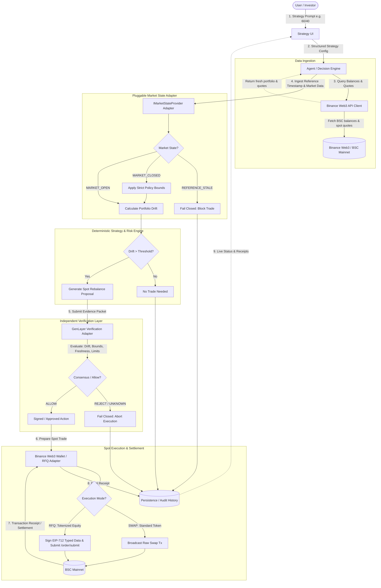

# StockPilot Architecture Specification

> **BNB Hack: Tokenized Stocks Edition**  
> **System**: StockPilot Autonomous BSC Portfolio Rebalancer  
> **Status**: Updated post-official documentation audit (Zero Mock Architecture)

---

## 1. System Overview

StockPilot provides an end-to-end autonomous pipeline for tokenized-stock portfolio management on BNB Smart Chain (BSC). It decouples portfolio monitoring, deterministic decision math, external independent verification, and mainnet execution.

---

## 2. End-to-End Rebalancing Flow

---

## 3. Subsystem Separation & Interfaces

### 3.1 Strategy UI (`src/client` / Web Dashboard)
- Visualizes user's plain-English strategy and structured target allocations.
- Displays real-time portfolio balance, target weights, actual weights, and drift percentage.
- Features a prominent **Market State Indicator** badge:
  - 🟢 `MARKET_OPEN`
  - 🟡 `MARKET_CLOSED`
  - 🔴 `REFERENCE_STALE` (Trading blocked)
- **Zero Mock Policy**: Displays explicit `"Not Connected"`, `"No live data available"`, and `"—"` states until real API/wallet feeds are connected.

### 3.2 Agent / Decision Engine (`src/agent/`)
- Orchestrates polling loops and event-driven rebalance checks.
- Coordinates the pipeline: Fetch → Evaluate State → Compute Drift → Verify → Execute → Log.

### 3.3 Binance Web3 API Client (`src/binance/`)
- Encapsulates authenticated calls to the **Binance Web3 Trading & Market APIs**:
  - `POST /api/v1/dex/market/price`: Real-time spot price discovery.
  - `POST /api/v1/dex/balance/token-balances-by-address`: Wallet holdings on BSC.
  - `GET /api/v1/dex/aggregator/quote`: Token swap quotes and execution mode (`SWAP` vs `RFQ`).
  - `GET /api/v1/dex/aggregator/swap`: Generates EIP-712 typed-data to sign (RFQ) or raw swap calldata.
  - `POST /api/v1/dex/aggregator/order/submit`: Submits signed RFQ orders with idempotency UUID.
  - `GET /api/v1/dex/aggregator/order/{orderId}`: Polls settlement status.
- Generates required `X-OC-APIKEY`, `X-OC-TIMESTAMP`, and `X-OC-SIGN` headers.

### 3.4 Pluggable Market State Provider (`src/strategy/market-state-provider.ts`)
- **Architectural Change**: Decoupled from hardcoded assumptions into an `IMarketStateProvider` interface.
- Evaluates whether trading sessions are active:
  - Supports rule-based schedules (e.g. US equities calendar) as an initial provider implementation.
  - Allows injecting live external market calendar feeds or reacting directly to Binance Web3 API market halt codes (`40369` / `40367`).
  - Fails closed to `REFERENCE_STALE` whenever data freshness exceeds `MAX_STALENESS_SECONDS`.

### 3.5 Strategy & Risk Engine (`src/strategy/`)
- Pure, deterministic calculation functions:
  - `calculateAllocation(balances, prices): PortfolioAllocation`
  - `calculateDrift(currentAllocation, targetAllocation): DriftResult`
  - `buildRebalanceProposal(allocation, drift, limits): RebalanceProposal | null`
- **Application Safety-Policy Defaults**: Slippage bounds (e.g., 50 bps for open, 25 bps for closed) and trade caps are explicitly modeled as StockPilot application safety policies rather than factual exchange constants.

### 3.6 Verification Adapter (`src/verification/`)
- Independent verification boundary connecting to **GenLayer**.
- Evaluates cryptographic evidence packets (drift calculation, quote freshness, market state, limits).
- **Does not execute trades**. Returns verifiable `ALLOW` or `REJECT`.
- Zero mock policy: Remains uncommitted until real GenLayer contract/RPC verification is invoked.

### 3.7 Execution Adapter (`src/execution/`)
- Manages transaction signing and settlement dispatch via **Binance Web3 Wallet / Agentic Wallet**:
  - For standard tokens: signs and broadcasts raw swap calldata on BSC mainnet.
  - For tokenized equities (bNVDA, Ondo): signs EIP-712 typed-data within the strict 30-second quote window and submits via `/api/v1/dex/aggregator/order/submit`.
- Captures transaction receipt and settlement hash.

### 3.8 Persistence & Audit Store (`src/storage/`)
- Maintains an immutable append-only record of all evaluations, verification outcomes, and transaction receipts.
