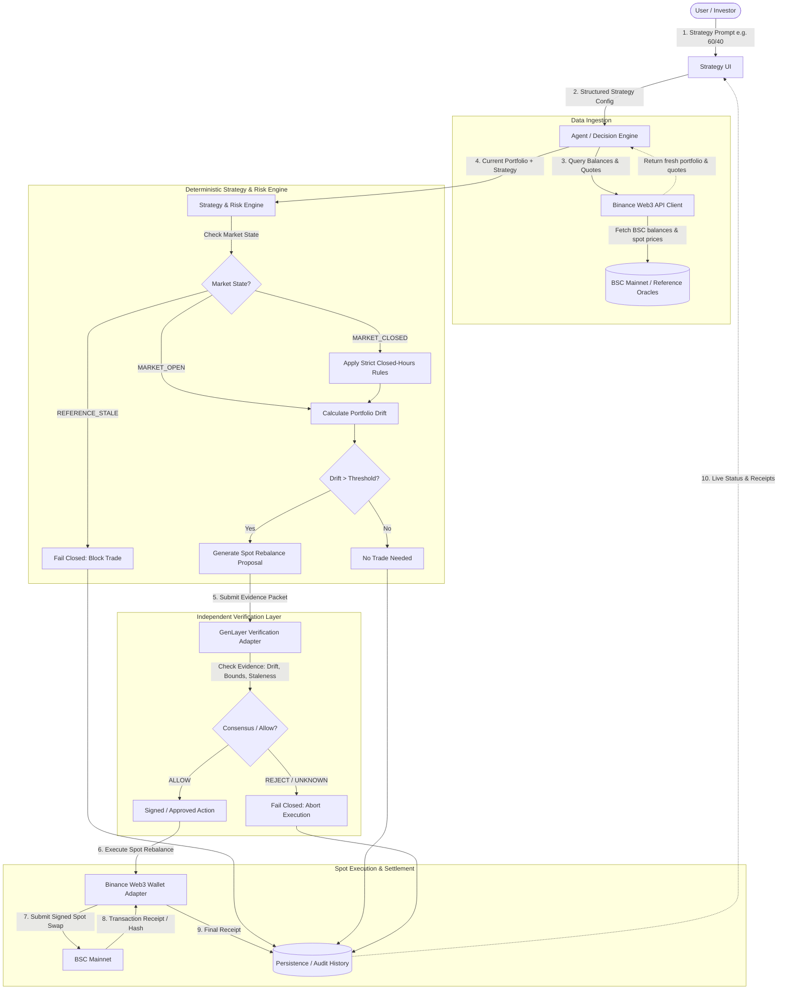

# StockPilot Architecture Specification

> **BNB Hack: Tokenized Stocks Edition**  
> **System**: StockPilot Autonomous BSC Portfolio Rebalancer

---

## 1. System Overview

StockPilot provides an end-to-end autonomous pipeline for tokenized-stock portfolio management on BNB Smart Chain (BSC). It decouples portfolio monitoring, deterministic decision math, external independent verification, and mainnet execution.

---

## 2. End-to-End Rebalancing Flow

---

## 3. Subsystem Separation & Interfaces

To maintain modularity and auditability, components are strictly separated into dedicated modules:

### 3.1 Strategy UI (`src/client` / Web Dashboard)
- Visualizes user's plain-English strategy and structured target allocations.
- Displays real-time portfolio balance, target weights, actual weights, and drift percentage.
- Features a prominent **Market State Indicator** badge:
  - 🟢 `MARKET_OPEN`
  - 🟡 `MARKET_CLOSED`
  - 🔴 `REFERENCE_STALE` (Trading blocked)
- Displays full audit timeline of rebalance evaluations, verification checks, and transaction receipts.

### 3.2 Agent / Decision Engine (`src/agent/`)
- Orchestrates polling loops and event-driven rebalance checks.
- Packages portfolio snapshots, strategy specifications, and market data into immutable evaluation contexts.
- Coordinates the pipeline: Fetch → Evaluate → Verify → Execute → Log.

### 3.3 Binance Web3 API Client (`src/binance/`)
- Encapsulates all calls to Binance Web3 APIs and DEX routing services on BSC.
- Methods:
  - `getWalletBalances(address: string): Promise<AssetBalance[]>`
  - `getSpotQuote(fromToken: string, toToken: string, amount: bigint): Promise<SpotQuote>`
  - `getReferenceMarketStatus(symbol: string): Promise<MarketReferenceStatus>`
- Records timestamps, latencies, request/response headers, and error codes directly to the DevEx log.

### 3.4 Strategy & Risk Engine (`src/strategy/`)
- Pure, deterministic calculation functions:
  - `calculateAllocation(balances, prices): PortfolioAllocation`
  - `calculateDrift(currentAllocation, targetAllocation): DriftResult`
  - `evaluateMarketState(referenceTimestamp, quoteTimestamp, marketHours): MarketState`
  - `buildRebalanceProposal(allocation, drift, limits): RebalanceProposal | null`
- Zero external dependencies in core calculation math, facilitating 100% test coverage with unit tests.

### 3.5 Verification Adapter (`src/verification/`)
- Adapts the proposed rebalance into a structured evidence packet for the **GenLayer verification layer**.
- Evidence evaluated:
  - User strategy hash & target weights
  - Starting portfolio balances & oracle prices
  - Calculated drift and required minimum threshold
  - Proposed spot trade direction (BUY/SELL) and size
  - Quote timestamp freshness (< max allowed staleness)
  - Market state confirmation
  - Max allowable trade slippage and max trade cap per rebalance
- **Never executes trades**. Returns a verified attestation (`ALLOW` or `REJECT` with reason code).

### 3.6 Execution Adapter (`src/execution/`)
- Interacts with **Binance Web3 Wallet / Agentic Wallet** to sign and broadcast BSC mainnet spot transactions.
- Spot-only enforcement: Rejects any parameter requesting leverage, margin, or perpetual contracts.
- Returns transaction hash, gas used, confirmed block, and final execution status.

### 3.7 Persistence & Audit Store (`src/storage/`)
- Maintains an append-only log of every evaluation cycle.
- Records:
  - Timestamp
  - Portfolio snapshot
  - Market state
  - Drift calculation
  - Rebalance proposal (if triggered)
  - Verification packet & result
  - On-chain transaction hash or fail-closed reason

---

## 4. Market State Definition & Behavior

| State | Underlying Market Condition | Tokenized Stock Trading on BSC | Permitted Rebalancing Actions |
|---|---|---|---|
| `MARKET_OPEN` | Traditional equities market is active; live oracle feeds updating | Active | Standard rebalancing permitted within normal slippage limits (e.g. ≤ 0.5%). |
| `MARKET_CLOSED` | US equity market closed (weekends, after-hours) | Active on-chain | Tighter risk bounds applied: reduced max rebalance size, tighter slippage tolerance (e.g. ≤ 0.25%), drift threshold may be increased to prevent reacting to transient illiquid spikes. |
| `REFERENCE_STALE` | Price feed or oracle not updated within max threshold (e.g. > 15 mins) | Halted / Untrusted | **Fail closed**. All rebalancing proposals are strictly blocked. Alert dispatched. |

---

## 5. Security & Secrets Management

- Zero secrets in frontend code or Git repository.
- `.env` strictly git-ignored; template documented in `.env.example`.
- API keys, private keys, and RPC endpoints accessed exclusively server-side.
