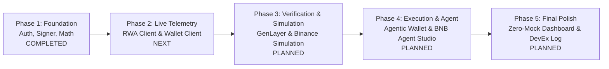

# StockPilot — Technical Build Notes & Implementation Roadmap

> **BNB Hack: Tokenized Stocks Edition** (Sep 16 – Oct 11, 2026)  
> **Core Asset**: `NVDA` Tokenized Equity — Backed NVIDIA (`NVDAB` — `0x02fca66c1d1afb4e2a7884261eb00f63598a7436`) & `USDC` (`0x8AC76a51cc950d9822D68b83fE1Ad97B32Cd580d`). *Address `0xA34C5e0AbE843E10461E2C9586Ea03E55Dbcc495` is [STALE / INVALIDATED BY LIVE BINANCE REGISTRY].*  

---

## 1. Verified Architecture & Design Decisions

### 1.1 Decision Pipeline Separation
The pipeline enforces zero ambiguity across layers:
1. **StockPilot Engine**: Pure deterministic calculations (portfolio weights, drift, spread intelligence, proposed rebalance delta).
2. **GenLayer Gate**: Independent cryptographic verification of proposed rebalance rules. **Never executes trades**.
3. **Binance Simulation**: Preflight simulation (`/api/v1/transaction/simulate` or `baw preflight`) verifying no reverts and estimating gas before signing. **Failed simulation halts execution**.
4. **Agentic Wallet / Trading**: Policy guardrails (daily limits) and EIP-712 typed-data signing for RFQ orders. **Does not evaluate strategy validity**.
5. **BSC Mainnet**: Decentralized on-chain settlement.

### 1.2 On-Chain vs. Reference Price Intelligence
- Formula:
  $$\text{spread} = \frac{\text{onchainPrice} - \text{referencePrice}}{\text{referencePrice}}$$
- Sourced directly from Binance RWA Data API (`/api/v1/dex/market/rwa/price` and `/underlying-market-data`).
- Only calculated when both feeds are valid and active; otherwise displays `—`.
- Integrated as a first-class risk check in `src/strategy/risk-engine.ts` (e.g. `maxSpreadBps` to prevent buying when on-chain price trades at excessive premium).

### 1.3 Authoritative Market Status
- Sourced from official Binance endpoints (verified in `binance-tokenized-securities-info`):
  - Overall: `GET https://www.binance.com/bapi/defi/v1/public/wallet-direct/buw/wallet/market/token/rwa/market/status/ai`
  - Asset: `GET https://www.binance.com/bapi/defi/v1/public/wallet-direct/buw/wallet/market/token/rwa/asset/market/status/ai?chainId=56&contractAddress=...`
- Status classifications: `open` (`regular`, `premarket`, `postmarket`, `overnight`), `closed`, `paused`, `halted`, `unavailable`, `unknown`.
- Never inferred from hardcoded calendars.

### 1.4 Division of Duties: REST API vs. Agentic Wallet Skills
- **Direct Web3 REST API (`src/binance/`)**: Background programmatic polling, market data, balance fetching, drift calculation, quote fetching, preflight simulation.
- **Agentic Wallet Skills (`.agents/skills/`)**:
  - `binance-tokenized-securities-info`: RWA metadata, attestation, session status.
  - `binance-agentic-wallet`: User policy guardrails (spending limits, token whitelists), EIP-712 signing for RFQ orders (`baw sign-message`).
- **BNB Agent Studio**: Persistent autonomous agent scheduling and event orchestration.

---

## 2. Updated Implementation Roadmap

### Phase 1: Foundation & Core Signer (COMPLETED)
- [x] Zero-mock strategy and deterministic risk engine (`src/strategy/risk-engine.ts`).
- [x] Pluggable market state provider interface (`src/strategy/market-state-provider.ts`).
- [x] Zero-leak cryptographic request signer with `/build` gateway support (`src/binance/request-signer.ts`).
- [x] Typed market data client (`src/binance/market-data-client.ts`).
- [x] 46/46 unit tests passing across vitest test suites.

### Phase 2: Authoritative RWA Telemetry & Deterministic Portfolio Engine (COMPLETED)
- [x] Implement `BinanceRwaClient` (`src/binance/rwa-client.ts`):
  - `searchRwaToken(keyword)`
  - `getRwaPriceAndSpread(query)`: Retrieves `tokenPrice`, `referencePrice`, calculates `spread` or returns `null` (rendering `—`).
  - `getUnderlyingMarketStatus(contractAddress)`: Authoritative status (`OPEN`, `CLOSED`, `PAUSED`, `HALTED`, `UNAVAILABLE`, `UNKNOWN`).
- [x] Implement `BinanceWalletBalanceClient` (`src/binance/wallet-balance-client.ts`):
  - Primary: `POST /build/api/v1/dex/balance/token-balances-by-address`
  - Redundant: Direct BSC JSON-RPC `eth_call` for `balanceOf`.
  - Zero-address rejection (`INVALID_WALLET`) and BigInt uint256 precision.
- [x] Implement `BinanceRwaAssetResolver` (`src/binance/asset-resolver.ts`):
  - Live registry-driven asset discovery by underlying ticker (`NVDA`) and platform discrimination (`bStocks` -> `NVDAB`, `Ondo` -> `NVDAon`).
  - Stale contract `0xA34C5e0AbE843E10461E2C9586Ea03E55Dbcc495` invalidated and rejected.
- [x] Live Read-Only Smoke Test Pipeline (`scripts/smoke-test-readonly-integration.ts`):
  - Verified live against Binance Web3 API and BSC Mainnet RPC: `USER_WALLET_PORTFOLIO_VERIFIED`.
- [x] Implement Real Deterministic Portfolio Strategy Engine (`src/strategy/portfolio-engine.ts`):
  - Produces 6 explicit states: `NO_ACTION`, `REBALANCE_REQUIRED`, `INSUFFICIENT_PORTFOLIO_DATA`, `MARKET_CLOSED`, `DATA_UNAVAILABLE`, `RISK_BLOCKED`.
  - Zero mock preservation: Fails closed to `INSUFFICIENT_PORTFOLIO_DATA` on zero balances (never invents a 60/40 allocation).
  - Evaluates live spread intelligence against `maxSpreadBps` (tripping `RISK_BLOCKED` when premium is excessive).
- [x] 126/126 unit & integration tests passing across 7 vitest test suites.

### Phase 3: Independent Verification & Transaction Simulation
- [ ] Implement `GenLayerVerificationAdapter` (`src/verification/genlayer-adapter.ts`).
- [ ] Implement `BinanceSimulationClient` (`src/binance/simulation-client.ts`):
  - `POST /api/v1/transaction/simulate`
  - Revert and gas exhaustion gate.
- [ ] Enforce sequential lifecycle: `PROPOSE → VERIFY → SIMULATE → EXECUTE`.

### Phase 4: Execution Pipeline & Agentic Wallet Integration
- [ ] Implement `BinanceTradingClient` (`src/binance/trading-client.ts`):
  - RFQ Quote polling (`GET /api/v1/dex/aggregator/quote`).
  - Signing payload generator (`GET /api/v1/dex/aggregator/swap`).
- [ ] Integrate Binance Agentic Wallet (`baw`) for user spending limit checks and EIP-712 typed-data signing.
- [ ] Connect with BNB Agent Studio workflow trigger.

### Phase 5: UI Integration & DevEx Report
- [ ] Connect live zero-mock telemetry to `public/index.html` dashboard.
- [ ] Maintain comprehensive `docs/hackathon-build/devex-log.md`.
- [ ] Produce submission deliverables (demo script, architectural diagrams).
